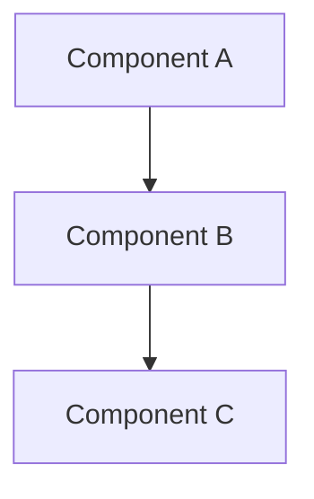

# YouTube to Blog Post Generator

This tool automatically generates blog-style summaries from YouTube videos using multiple Language Models (LLMs). It processes the video transcript and creates comprehensive summaries using Gemini, GPT-4, and Claude.

## Features

- Extract transcripts from YouTube videos
- Generate blog-style summaries using multiple LLMs:
  - Google's Gemini
  - OpenAI's GPT-4
  - Anthropic's Claude
- Support for both full YouTube URLs and video IDs
- Cache management for transcripts and summaries
- Force regeneration option for updating existing summaries
- Structured blog post format with:
  - Introduction
  - Technical Overview
  - Deep Dive Analysis
  - Practical Implementation
  - Discussion Points
  - Key Takeaways
- Mermaid diagram generation for technical concepts

## Prerequisites

- Python 3.8 or higher
- API keys for:
  - Google AI (Gemini)
  - OpenAI (GPT-4)
  - Anthropic (Claude)

## Installation

1. Clone the repository:
```bash
git clone <repository-url>
cd yt-2-blog
```

2. Create and activate a virtual environment:
```bash
# Using venv
python -m venv venv
source venv/bin/activate  # On Unix/macOS
venv\Scripts\activate     # On Windows

# Or using uv (faster)
uv venv
source .venv/bin/activate  # On Unix/macOS
.venv\Scripts\activate     # On Windows
```

3. Install dependencies:
```bash
# Using pip
pip install -r requirements.txt

# Or using uv (faster)
uv pip install -r requirements.txt
```

4. Set up your environment variables:
```bash
# Create a .env file
touch .env

# Add your API keys
echo "GOOGLE_API_KEY=your_gemini_api_key" >> .env
echo "OPENAI_API_KEY=your_openai_api_key" >> .env
echo "ANTHROPIC_API_KEY=your_anthropic_api_key" >> .env
```

## Usage

### Basic Usage

Process a video using its URL or ID:
```bash
# Using full YouTube URL
python cli.py https://www.youtube.com/watch?v=VIDEO_ID

# Using just the video ID
python cli.py VIDEO_ID
```

### Advanced Options

1. Custom suffix for output files:
```bash
python cli.py VIDEO_ID -s custom_name
```

2. Force regeneration of summaries:
```bash
python cli.py VIDEO_ID --force
```

### Output Structure

The tool generates several files in the `outputs` directory:
- `VIDEO_ID_transcript.json`: Raw transcript data
- `VIDEO_ID_suffix_gemini-pro_summary.md`: Gemini's summary
- `VIDEO_ID_suffix_gpt-4_summary.md`: GPT-4's summary
- `VIDEO_ID_suffix_claude-3-haiku_summary.md`: Claude's summary
- `VIDEO_ID_suffix_combined_summary.md`: Combined summary from all models

### Example Output Format

Each summary follows this structure:
```markdown
# Title

## Introduction
- Overview of the topic
- Core concepts

## Technical Overview
- Key concepts explained
- System architecture


## Deep Dive Analysis
- Detailed examination
- Implementation details
- Performance considerations

[...other sections...]
```

## Configuration

The tool uses the following model versions by default:
- Gemini: `gemini-pro`
- GPT: `gpt-4`
- Claude: `claude-3-haiku`

You can modify these in `settings.py`.

## Error Handling

The tool handles various error cases:
- Invalid YouTube URLs/IDs
- Missing API keys
- Failed API calls
- Rate limiting
- Network issues

If an error occurs, it will display a descriptive message and exit gracefully.

## Contributing

1. Fork the repository
2. Create your feature branch
3. Commit your changes
4. Push to the branch
5. Create a Pull Request

## License

This project is licensed under the MIT License - see the LICENSE file for details.

